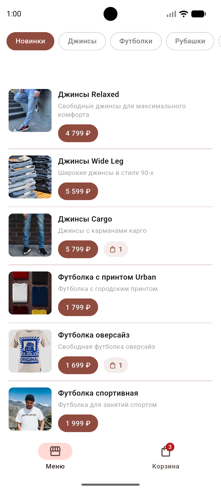
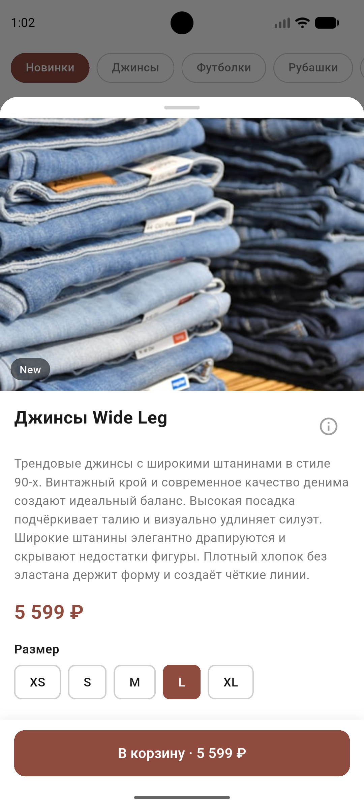
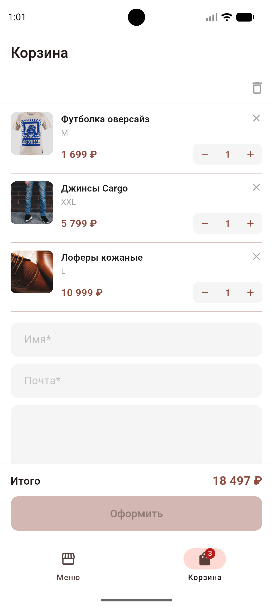

Студенческий проект: team-mouse

# Mouse Store

> **Mouse Store** — мобильное Flutter-приложение магазина одежды для Android.  
> Позволяет просматривать каталог товаров по категориям, изучать детали товара и оформлять заказ через корзину.

---

## Скриншоты

| Каталог | Детали товара | Корзина |
|---------|--------------|---------|
|  |  |  |
---

## Выбранный стек и платформа

| Компонент | Технология |
|-----------|-----------|
| Язык | Dart 3 |
| UI-фреймворк | Flutter |
| Целевая платформа | Android (минимум SDK по умолчанию Flutter) |
| Управление состоянием | Provider (ChangeNotifier) |
| Локальная БД | SQLite (sqflite) |
| HTTP-клиент | package:http |
| Постоянные настройки | SharedPreferences |
| Линтер | flutter_lints |

---

## Архитектура

Приложение построено по паттерну **MVVM** (Model — View — ViewModel) с явным разделением на слои данных.

```
┌──────────────────────────────────────────────────┐
│             View (Flutter Widgets)               │
│  catalog_screen  │  cart_screen  │  widgets/...  │
└─────────────────────────┬────────────────────────┘
                          │ watch / Consumer
┌─────────────────────────▼────────────────────────┐
│               ViewModel (ChangeNotifier)         │
│       CatalogViewModel  │  CartViewModel         │
└──────────┬──────────────┴──────────┬─────────────┘
           │                         │
┌──────────▼────────────┐  ┌─────────▼─────────────┐
│  ProductRepository    │  │    CartDatabase       │
│  (cache-first)        │  │    (SQLite: cart.db)  │
├──────────┬────────────┤  └───────────────────────┘
│CatalogApi│CatalogDb   │
│(HTTP)    │(SQLite)    │
└──────────┴────────────┘

Модели: Product, ProductSize, Category, CartLine
```

### Ключевые решения

- **Cache-first**: каталог сначала отдаётся из SQLite-кэша, затем обновляется с API в фоне.
- **Offline-режим**: при отсутствии сети и наличии кэша показывается баннер, ошибка не выбрасывается.
- **Персистентная корзина**: позиции корзины хранятся в `cart.db`; после перезапуска состояние восстанавливается.
- **Инъекция зависимостей**: ViewModels и репозитории принимают зависимости через конструктор — упрощает тестирование.

---

## Состав команды и роли

1. Ватутин Алексей — разработчик
2. Андрюков Алексей — разработчик
3. Бовтрюк Александр — разработчик

---

## Функциональность

- Каталог товаров с фильтрацией по категориям и вкладкой «Новинки»
- Детальный bottom sheet товара: фото, описание, характеристики, выбор размера
- Корзина с управлением количеством (+ / −) и persistent-хранением в SQLite
- Форма оформления заказа (имя, e-mail, комментарий) с валидацией
- Скелетон-анимация при загрузке
- Офлайн-режим с кэшем каталога

---

## Инструкция по сборке

### Требования

- Flutter SDK `^3.11.3` ([flutter.dev/docs/get-started](https://flutter.dev/docs/get-started))
- Android SDK (через Android Studio)
- JDK 17

### Запуск в режиме отладки

```bash
flutter pub get
flutter run
```

### Сборка APK

```bash
flutter build apk --release
```

Готовый APK будет в `build/app/outputs/flutter-apk/app-release.apk`.

### Запуск тестов

```bash
# Все тесты (unit + widget)
flutter test

# Только unit-тесты
flutter test test/unit_test.dart
```

### Проверка линтера

```bash
flutter analyze
```

---

*Сделано с ❤️ командой Team-Mouse*
