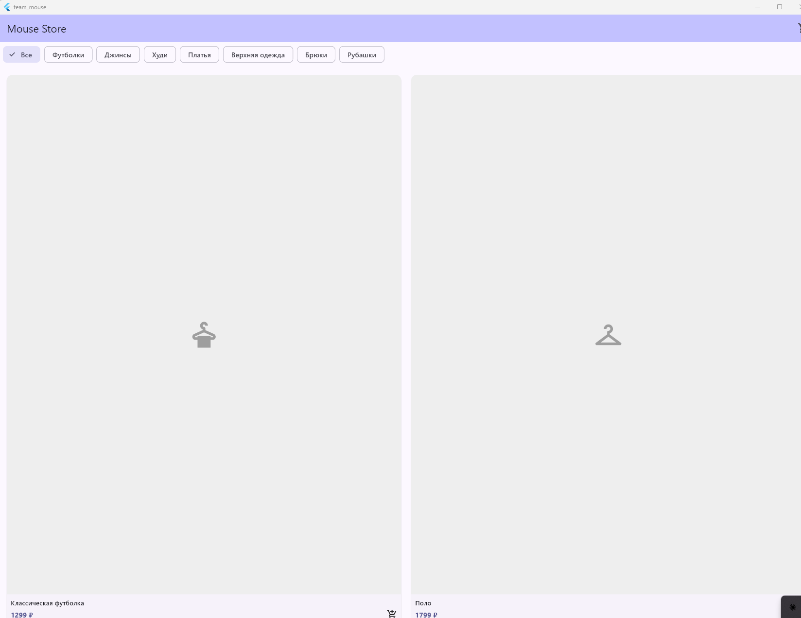

Студенческий проект: team-mouse
# Mouse Store

> **Mouse Store** — мобильное приложение магазина одежды для Android. Позволяет просматривать каталог товаров по категориям и добавлять позиции в корзину.

---

## Выбранный стек и платформа

- Dart / Flutter
- Android Studio

---

## Состав команды


1. Андрюков Алексей
2. Бовтрюк Александр 
3. Ватутин Алексей

---

## Функциональность

- Каталог товаров в виде сетки с иконками
- Фильтрация по категориям (Футболки, Джинсы, Худи, Платья и др.)
- Добавление товаров в корзину
- Страница корзины с итоговой суммой и кнопкой оформления заказа

---

## Запуск и сборка

```bash
flutter pub get
flutter run
```

Для сборки APK:

```bash
flutter build apk --debug
```

---

## Скриншот


---

*Сделано с ❤️ командой Team-Mouse*
